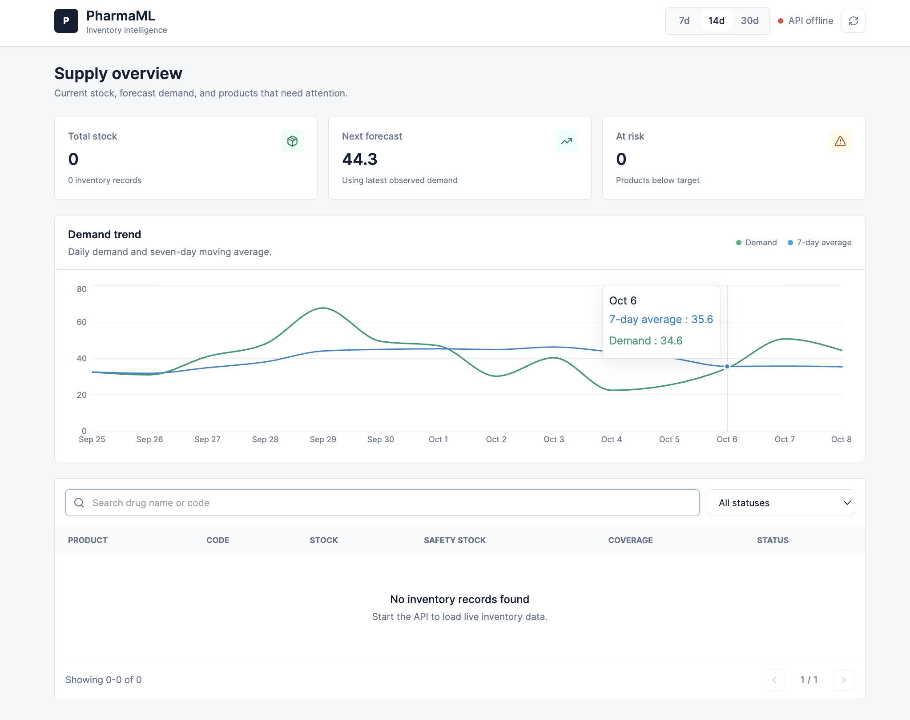
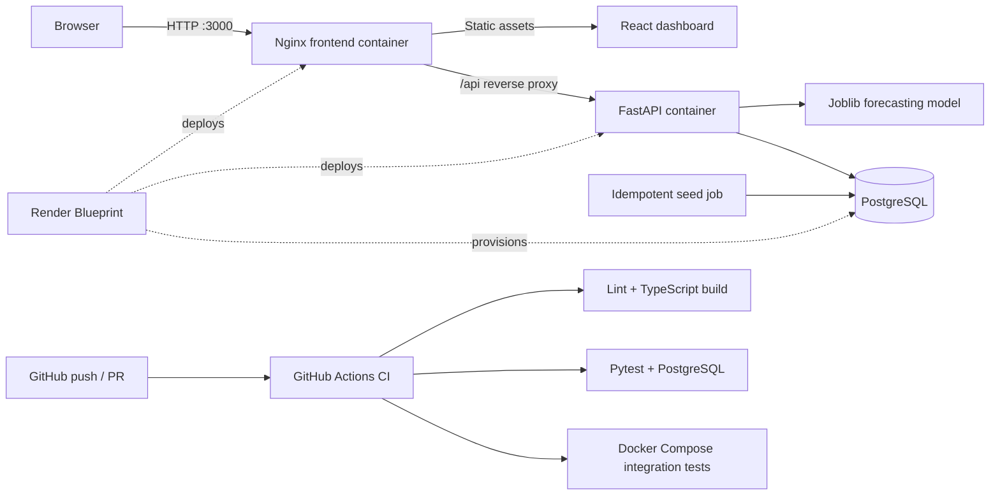

# PharmaML

[](https://github.com/Rishi-Mishima/pharmPrediciton/actions/workflows/ci.yml)
[](https://render.com/deploy?repo=https://github.com/Rishi-Mishima/pharmPrediciton)

PharmaML is a pharmaceutical demand forecasting and inventory intelligence platform. It combines a trained forecasting model, FastAPI, PostgreSQL, and a React operations dashboard in a production-shaped container stack.

## Dashboard



The dashboard shows current stock, next-day forecast demand, inventory risk, demand trends, filters, and product-level replenishment details. If the API is unavailable, only the chart uses isolated sample history; live inventory is never fabricated.

## Architecture



### Request Flow

1. Nginx serves the compiled React application.
2. Browser requests to `/api/*` are proxied to FastAPI, so production uses one browser origin and does not depend on a hard-coded API hostname.
3. FastAPI loads the saved model, reads and writes PostgreSQL data, and returns forecasts and inventory risk.
4. The seed job runs after the API is healthy. It creates Paracetamol, imports only missing demand dates, and ensures an initial inventory record exists.

## One-Command Start

### Prerequisites

- Docker Desktop with Docker Compose
- At least 4 GB of memory available to Docker

Start the complete stack from the repository root:

```bash
docker compose up --build
```

That single command starts the services in dependency order:

```text
PostgreSQL -> FastAPI -> idempotent seed job -> Nginx/React frontend
```

Open:

- Dashboard: <http://localhost:3000>
- API documentation: <http://localhost:8000/docs>
- API health: <http://localhost:3000/api/health>

To run in the background:

```bash
docker compose up --build -d
docker compose ps
```

To stop the stack without deleting database data:

```bash
docker compose down
```

The PostgreSQL named volume is preserved between restarts. The seed job is safe to run again and inserts only missing data.

## Local Frontend Development

For Vite hot reload, keep the database and API in Docker and run the frontend locally:

```bash
docker compose up --build -d db api seed

cd frontend
npm install
cp .env.example .env
npm run dev
```

Open <http://localhost:5173>. Vite proxies `/api` to `http://localhost:8000`.

## Tests

### Frontend

```bash
cd frontend
npm run lint
npm run build
```

### Backend

With the Compose stack running:

```bash
docker compose exec api pytest tests/test_api.py -q
```

### Full-Stack Integration

The integration suite verifies:

- Nginx serves the production frontend
- `/api` correctly proxies FastAPI
- the API and model are healthy
- seeded drug and inventory records are available
- a forecast can be generated from seeded history

Run it with:

```bash
docker compose exec \
  -e RUN_INTEGRATION_TESTS=1 \
  -e API_BASE_URL=http://api:8000 \
  -e FRONTEND_BASE_URL=http://frontend \
  api pytest tests/integration -q
```

## Continuous Integration

[`.github/workflows/ci.yml`](.github/workflows/ci.yml) runs on pushes to `main` and on pull requests.

| Job | What it validates |
|---|---|
| Frontend lint and build | ESLint, TypeScript, and the production Vite bundle |
| Backend tests | FastAPI tests against a PostgreSQL service container |
| Full-stack integration | Production containers, health checks, seed data, Nginx proxy, and forecasts |

The integration job prints container logs on failure and always removes its temporary containers and volume.

## Cloud Deployment

The repository includes a [`render.yaml`](render.yaml) Blueprint that declares:

- a Dockerized Nginx/React web service
- a Dockerized FastAPI web service
- a managed PostgreSQL database
- private service-to-service API routing
- health checks and idempotent pre-deploy seeding

To deploy:

1. Push the repository to GitHub.
2. Click **Deploy to Render** at the top of this README, or create a new Blueprint in Render and select this repository.
3. Review the three resources and apply the Blueprint.
4. Open the generated `pharmaml-dashboard` URL after all health checks pass.

No database password or API hostname is committed. Render injects the PostgreSQL connection string and internal API host from Blueprint resource references. See the official [Render Blueprint documentation](https://render.com/docs/infrastructure-as-code) for account and plan details.

## Configuration

| Variable | Service | Default / purpose |
|---|---|---|
| `DATABASE_URL` | API and seed | PostgreSQL connection string; generic provider URLs are normalized for psycopg 3 |
| `CORS_ORIGINS` | API | Comma-separated origins for direct browser API access |
| `PORT` | API/frontend | Container listening port; cloud platforms can inject it |
| `API_HOSTPORT` | frontend | Internal FastAPI host and port used by Nginx |
| `VITE_API_BASE_URL` | Vite build | `/api` by default |

## Inventory Rules

- **Critical:** `current_stock <= safety_stock * 0.5`
- **Low Stock:** `current_stock <= safety_stock`
- **Healthy:** `current_stock > safety_stock`

## API

| Method | Endpoint | Purpose |
|---|---|---|
| `GET` | `/health` | API and model health |
| `GET` | `/model/info` | Model type, features, and metrics |
| `POST` | `/predict` | Feature-based demand prediction |
| `GET` | `/drugs` | List drugs |
| `POST` | `/drugs` | Create a drug |
| `GET` | `/drugs/{drug_id}/demand-history` | Retrieve demand history |
| `POST` | `/drugs/{drug_id}/forecast` | Forecast the next demand value |
| `GET` | `/inventory` | List inventory records |
| `POST` | `/inventory` | Create an inventory record |
| `GET` | `/inventory/{drug_id}/risk` | Forecast-based inventory risk |

## Model

The forecasting model uses 1, 7, 14, and 28-day lag features; 7 and 28-day rolling means; cyclical calendar features; and a weekend indicator. Linear Regression was selected using time-series cross-validation.

| Metric | Result |
|---|---:|
| Cross-validation MAE | 9.229 |
| Test MAE | 9.456 |
| Test RMSE | 12.299 |
| Test WAPE | 30.86% |

## Project Structure

```text
PharmaML/
|-- .github/workflows/ci.yml     # Frontend, backend, and integration CI
|-- app/                         # FastAPI, SQLAlchemy, and model serving
|-- data/                        # Raw and processed demand data
|-- docs/images/                 # Dashboard screenshots
|-- frontend/                    # React app and production Nginx image
|-- models/                      # Saved forecasting model and metadata
|-- scripts/                     # Idempotent database seed job
|-- tests/integration/           # Live full-stack tests
|-- docker-compose.yml           # Local full-stack orchestration
|-- render.yaml                  # Render cloud infrastructure
|-- Dockerfile                   # FastAPI image
`-- README.md
```

## Troubleshooting

### Docker cannot connect to `docker.sock`

Start Docker Desktop and wait until this succeeds:

```bash
docker info
```

### A service does not become healthy

```bash
docker compose ps -a
docker compose logs api frontend seed db
```

### Port already in use

The stack uses host ports `3000`, `8000`, and `5432`. Stop the conflicting process or change the published port on the left side of the corresponding mapping in `docker-compose.yml`.
